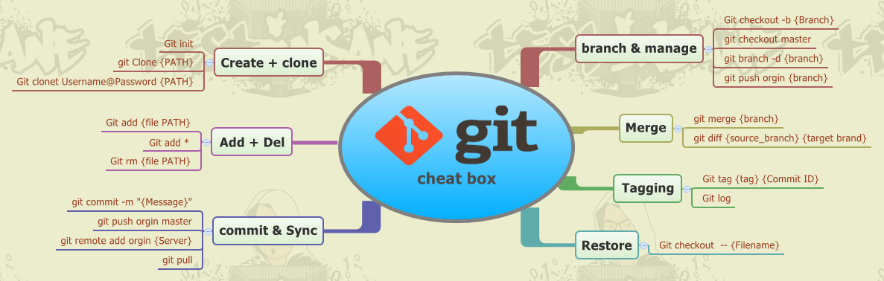

# Руководство по работе с Гитом

## Basic functional Git ##

**Functional working of repozitiry**

**Resize for commit**

### Main commands Git

* git add FileName **(add changes)**

* git commit -m "name of the change" **(make changes)**

* git checkout namecommit **(transition to changes)**

##Download ##

* For Git click here [https://git-scm.com/downloads](https://git-scm.com/downloads)

 ## about quotes
 
> The Markdown language uses the "more" (">") sign to indicate quotations. It can be inserted both before each line of the quotation, and only before the first line of the paragraph. Also, the Markdown syntax allows you to create nested quotes (quotes inside quotes). Additional levels of citation marks (">") are used to mark them. Quotes in Markdown can contain all kinds of markup elements.